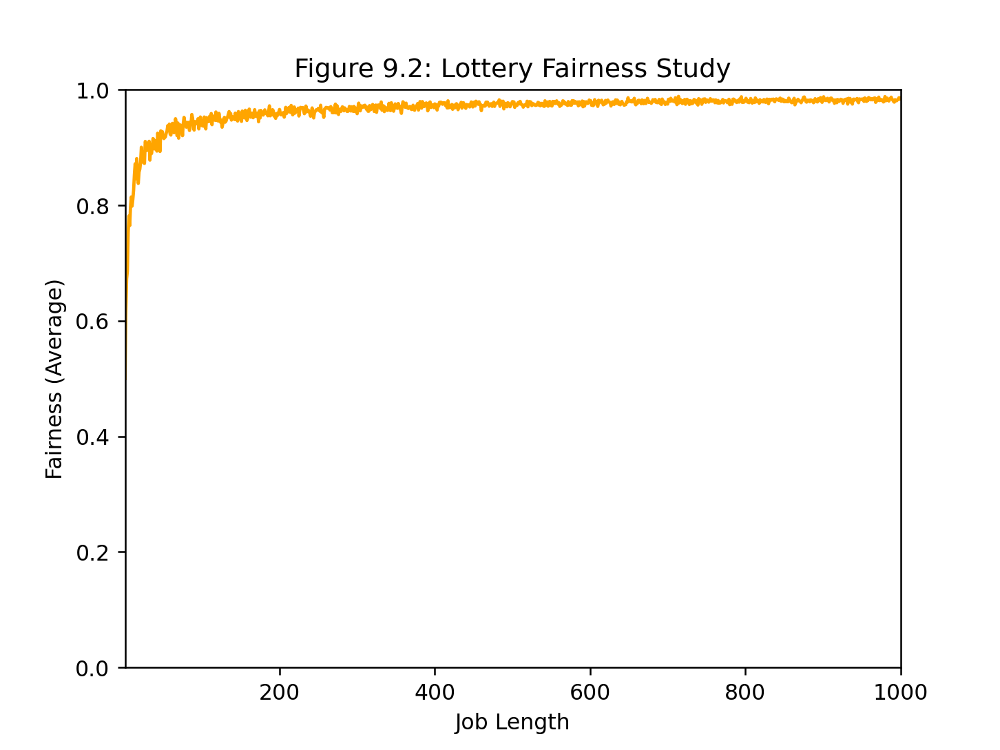
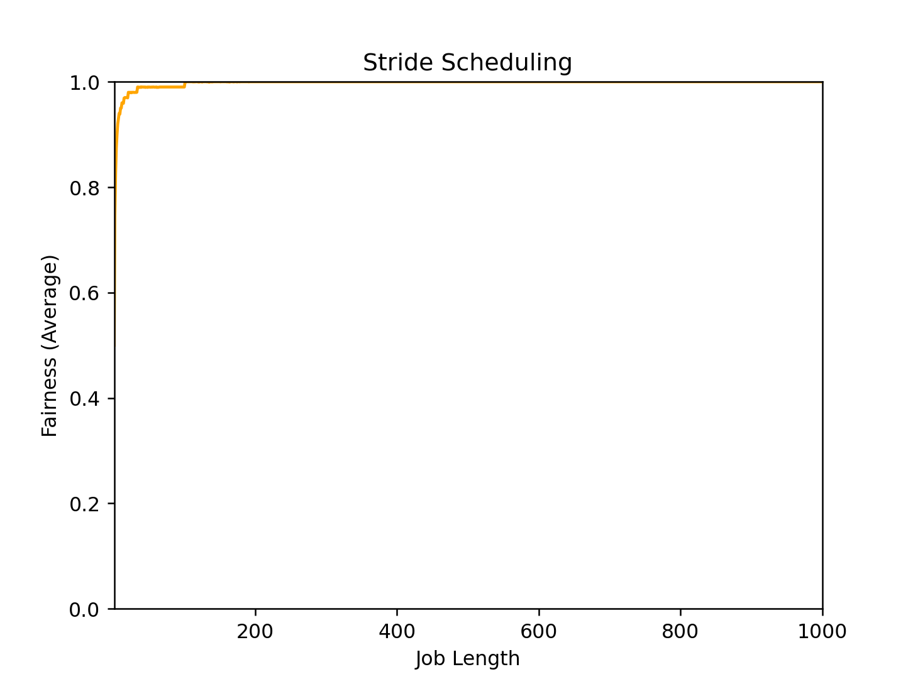

# Scheduling: Proportional Share

## Homework (Simulation)

This program, `lottery.py`, allows you to see how a lottery scheduler works. See the README for details.

### Questions

1. Compute the solutions for simulations with 3 jobs and random seeds of 1, 2, and 3.

    ```
    $ python3 lottery.py -s 1 -j 3 -c
    $ python3 lottery.py -s 2 -j 3 -c
    $ python3 lottery.py -s 3 -j 3 -c
    ```
    ```
    $ python3 lottery.py -s 1 -j 3 -c
    ```
```
Here is the job list, with the run time of each job: 
  Job 0 ( length = 1, tickets = 84 )
  Job 1 ( length = 7, tickets = 25 )
  Job 2 ( length = 4, tickets = 44 )


** Solutions **

Random 651593 -> Winning ticket 119 (of 153) -> Run 2
  Jobs:
 (  job:0 timeleft:1 tix:84 )  (  job:1 timeleft:7 tix:25 )  (* job:2 timeleft:4 tix:44 ) 
Random 788724 -> Winning ticket 9 (of 153) -> Run 0
  Jobs:
 (* job:0 timeleft:1 tix:84 )  (  job:1 timeleft:7 tix:25 )  (  job:2 timeleft:3 tix:44 ) 
--> JOB 0 DONE at time 2
Random 93859 -> Winning ticket 19 (of 69) -> Run 1
  Jobs:
 (  job:0 timeleft:0 tix:--- )  (* job:1 timeleft:7 tix:25 )  (  job:2 timeleft:3 tix:44 ) 
Random 28347 -> Winning ticket 57 (of 69) -> Run 2
  Jobs:
 (  job:0 timeleft:0 tix:--- )  (  job:1 timeleft:6 tix:25 )  (* job:2 timeleft:3 tix:44 ) 
Random 835765 -> Winning ticket 37 (of 69) -> Run 2
  Jobs:
 (  job:0 timeleft:0 tix:--- )  (  job:1 timeleft:6 tix:25 )  (* job:2 timeleft:2 tix:44 ) 
Random 432767 -> Winning ticket 68 (of 69) -> Run 2
  Jobs:
 (  job:0 timeleft:0 tix:--- )  (  job:1 timeleft:6 tix:25 )  (* job:2 timeleft:1 tix:44 ) 
--> JOB 2 DONE at time 6
Random 762280 -> Winning ticket 5 (of 25) -> Run 1
  Jobs:
 (  job:0 timeleft:0 tix:--- )  (* job:1 timeleft:6 tix:25 )  (  job:2 timeleft:0 tix:--- ) 
Random 2106 -> Winning ticket 6 (of 25) -> Run 1
  Jobs:
 (  job:0 timeleft:0 tix:--- )  (* job:1 timeleft:5 tix:25 )  (  job:2 timeleft:0 tix:--- ) 
Random 445387 -> Winning ticket 12 (of 25) -> Run 1
  Jobs:
 (  job:0 timeleft:0 tix:--- )  (* job:1 timeleft:4 tix:25 )  (  job:2 timeleft:0 tix:--- ) 
Random 721540 -> Winning ticket 15 (of 25) -> Run 1
  Jobs:
 (  job:0 timeleft:0 tix:--- )  (* job:1 timeleft:3 tix:25 )  (  job:2 timeleft:0 tix:--- ) 
Random 228762 -> Winning ticket 12 (of 25) -> Run 1
  Jobs:
 (  job:0 timeleft:0 tix:--- )  (* job:1 timeleft:2 tix:25 )  (  job:2 timeleft:0 tix:--- ) 
Random 945271 -> Winning ticket 21 (of 25) -> Run 1
  Jobs:
 (  job:0 timeleft:0 tix:--- )  (* job:1 timeleft:1 tix:25 )  (  job:2 timeleft:0 tix:--- ) 
--> JOB 1 DONE at time 12
```

2. Now run with two specific jobs: each of length 10, but one (job 0) with just 1 ticket and the other (job 1) with 100 (e.g., `-l 10:1,10:100`). What happens when the number of tickets is so imbalanced? Will job 0 ever run before job 1 completes? How often? In general, what does such a ticket imbalance do to the behavior of lottery scheduling?

    ```
    $ python3 lottery.py -l 10:1,10:100 -c
    ``` 

    As a result, job 1 has more opportunities to run, in the competition of choosing job 1 or job 0 to run at the next second.

    It depends. The probability is 1/100 for job 0 running before job 1 completes

    Not fair for the fewer tickets jobs.

3. When running with two jobs of length 100 and equal ticket allocations of 100 (`-l 100:100,100:100`), how unfair is the scheduler? Run with some different random seeds to determine the (probabilistic) answer; let unfairness be determined by how much earlier one job finishes than the other.

    ```
    $ python3 lottery.py -s 0 -l 100:100,100:100 -c
    U = 192/200 = 0.96

    $ python3 lottery.py -s 1 -l 100:100,100:100 -c
    U = 192/200 = 0.96

    $ python3 lottery.py -s 2 -l 100:100,100:100 -c
    U = 190/200 = 0.95

    $ python3 lottery.py -s 3 -l 100:100,100:100 -c
    U = 196/200 = 0.98
    ```

4. How does your answer to the previous question change as the quantum size (`-q`) gets larger?

    Less quantum size is more fair.

5. Can you make a version of the graph that is found in the chapter? What else would be worth exploring? How would the graph look with a stride scheduler?

    ```
    $ python3 lottery_fairness_graph.py
    ```

    

    explore turnaround time, response time.
    ```
    $ python3 stride_graph.py
    ```

    
